# Woliba Registration Flow (Vite + React)

Multi-step registration SPA for the Woliba wellness platform coding challenge. Built with **Vite**, **React (functional components)**, **React Router**, and **Redux Toolkit** (no TypeScript in app code).

## App Overview
- **8-step flow**: company verification → user details → OTP → profile → interests → pillars → processing → welcome
- **Protected routes / route guards**: users can’t skip steps
- **Optimized API handling**: centralized Axios client + consistent error messages
- **Loader & skeleton states**: smooth loading UX on data-driven steps
- **Error boundaries**: graceful recovery UI if a runtime error happens
- **Accessibility**: `aria-*`, `role="status"`, keyboard-friendly controls
- **Unit tests**: route guard + helper + redux slice tests (Vitest)

## Features (Bonus Points Coverage)
- **8-step flow**: company verification → user details → OTP → profile → interests → pillars → processing → welcome
- **Stateful step guards** with React Router + Redux
- **API integration** (Axios) with consistent error normalization
- **Responsive UI** aligned with the provided Figma designs
- **Reusable components**: `Button`, `Input`, `StepActions`, `Skeleton`, `Layout`, etc.
- **Unit test cases written** with Vitest + Testing Library
- **Proper error boundary** at app root
- **Loader & skeleton states** for Interests and Pillars

## Setup Instructions

```bash
npm install
npm run dev
```

Open `http://localhost:5173`.

## Libraries/Tools Used
- **Vite**: dev server + build
- **React**: UI (functional components)
- **React Router DOM**: client-side routing
- **Redux Toolkit + React Redux**: state management
- **Axios**: HTTP client
- **ESLint**: linting
- **Vitest + Testing Library**: unit tests

## Scripts
- **dev**: `npm run dev`
- **lint**: `npm run lint`
- **build**: `npm run build`
- **preview**: `npm run preview`
- **test**: `npm run test`
- **test:run**: `npm run test:run`
- **test:coverage**: `npm run test:coverage`

## Folder Structure

```txt
src/
├── api/              # API endpoint functions
├── assets/           # Images, icons, loader video
├── components/       # Reusable UI (Input, Button, OtpInput, Layout, etc.)
├── pages/            # One page per step
├── redux/            # Store + slice + hooks
├── routes/           # Routes + protected route guard
├── services/         # Axios client
├── styles/           # Global CSS + variables
└── utils/            # Constants + validation + API helpers
```

## Screenshots of Each Step

Add screenshots under `docs/screenshots/` using the naming format below.  
Some steps can contain multiple screenshots.

### Screenshot Naming Convention

| Step | Example Files |
|------|----------------|
| Step 1 | `P-1.1.png` |
| Step 2 | `P-2.1.png`, `P-2.2.png`, `P-2.3.png` |
| Step 3 | `P-3.1.png`, `P-3.2.png` |
| Step 4 | `P-4.1.png` |
| Step 5 | `P-5.1.png`, `P-5.2.png`, `P-5.3.png` |
| Step 6 | `P-6.1.png`, `P-6.2.png` |
| Step 7 | `P-7.1.png`, `P-7.2.png` |
| Step 8 | `P-8.1.png` |

---

## Step 1 — Company Verify

- `docs/screenshots/P-1.1.png`

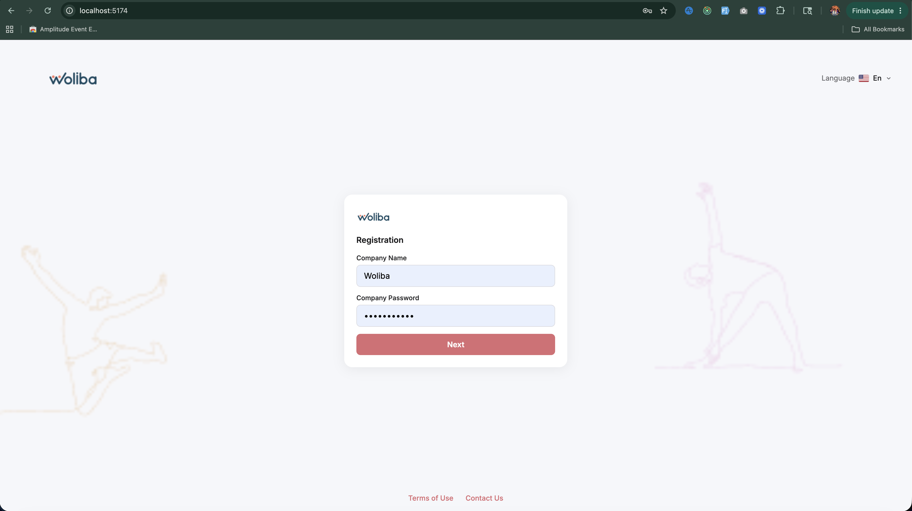

---

## Step 2 — User Details

- `docs/screenshots/P-2.1.png`
- `docs/screenshots/P-2.2.png`
- `docs/screenshots/P-2.3.png`

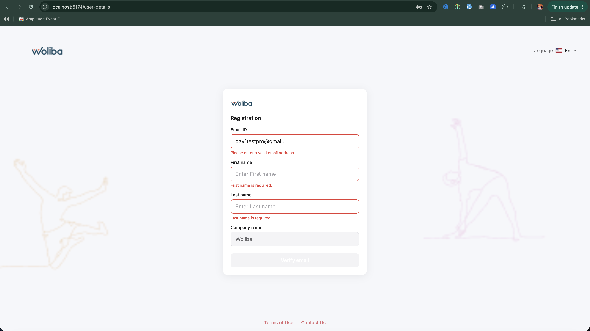
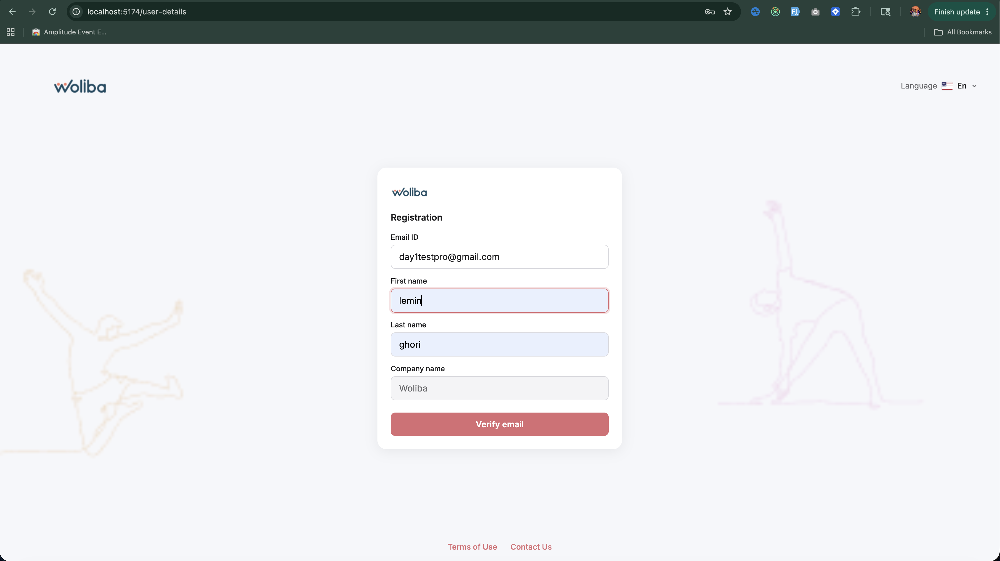
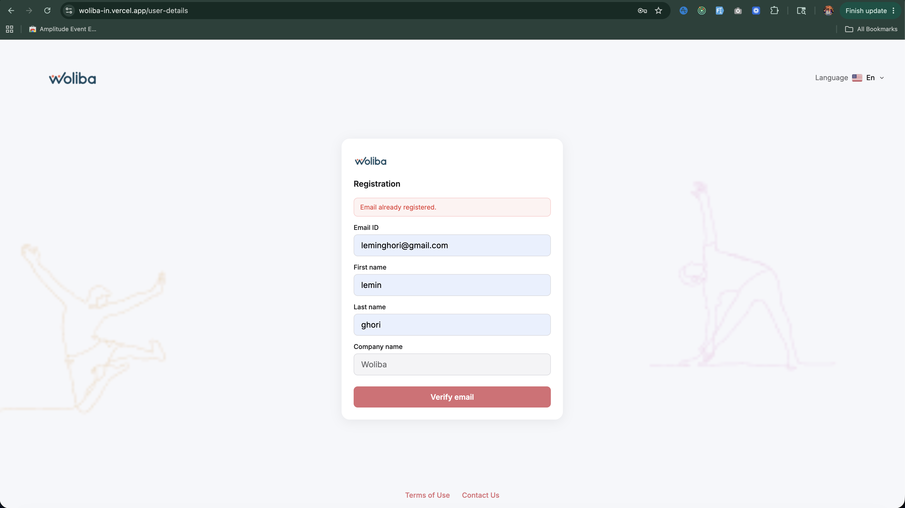

---

## Step 3 — OTP Verification

- `docs/screenshots/P-3.1.png`
- `docs/screenshots/P-3.2.png`

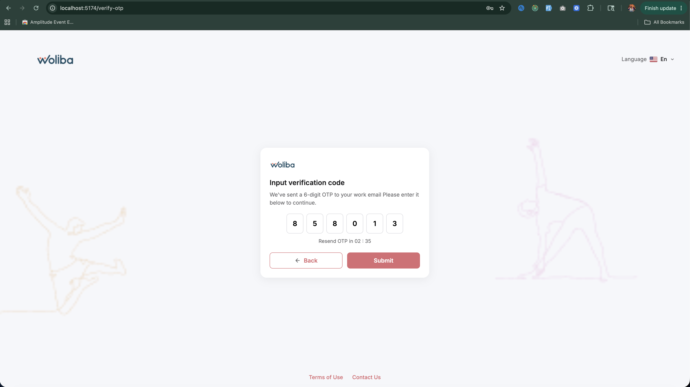


---

## Step 4 — Complete Profile

- `docs/screenshots/P-4.1.png`

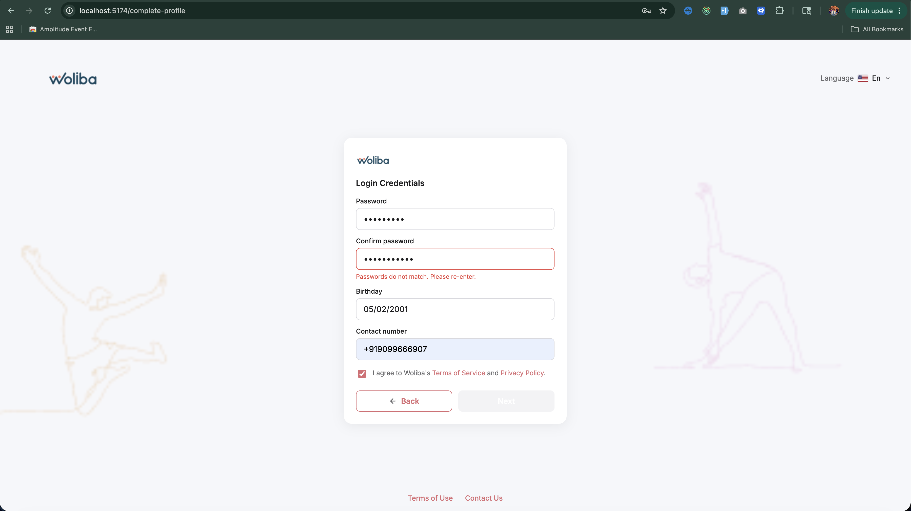

---

## Step 5 — Interests

- `docs/screenshots/P-5.1.png`
- `docs/screenshots/P-5.2.png`
- `docs/screenshots/P-5.3.png`

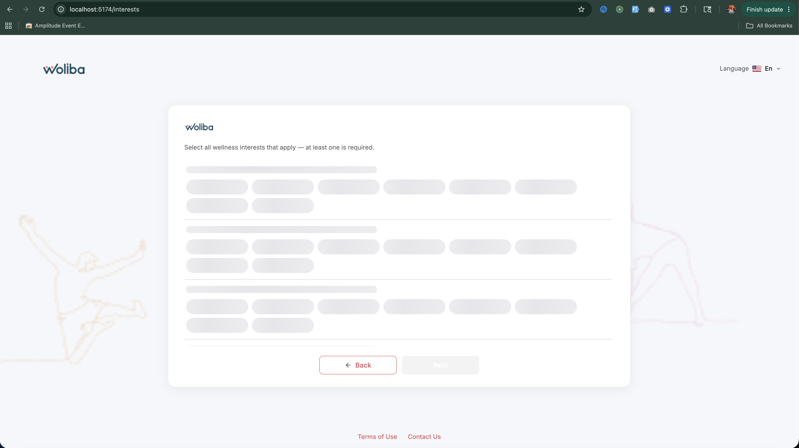
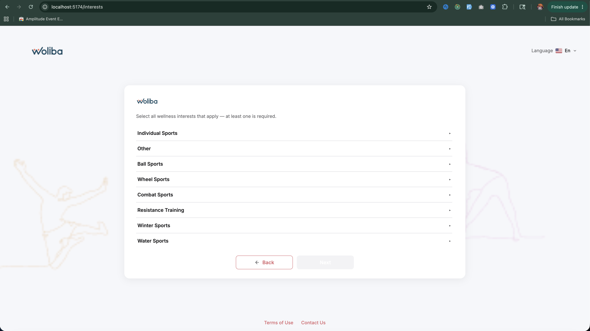
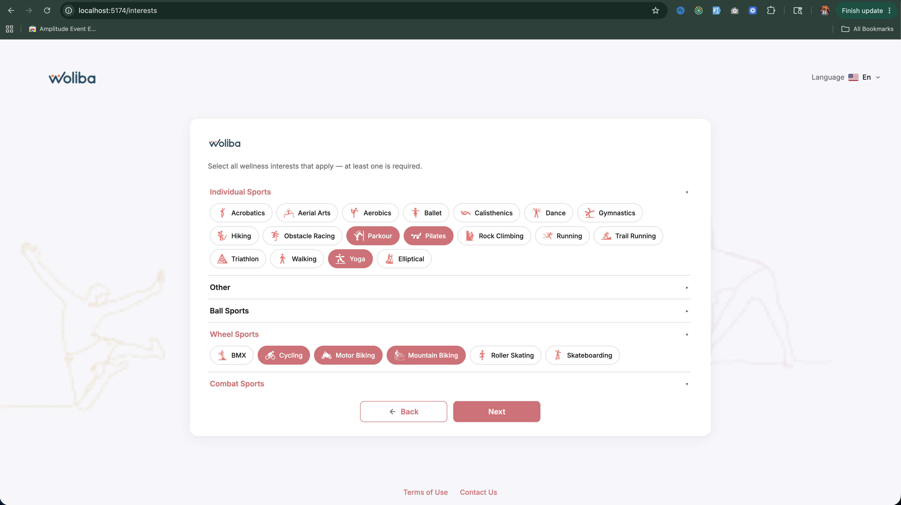

---

## Step 6 — Wellbeing Pillars

- `docs/screenshots/P-6.1.png`
- `docs/screenshots/P-6.2.png`

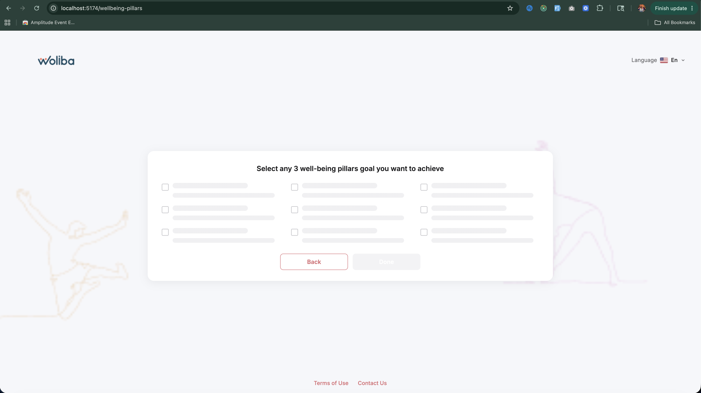
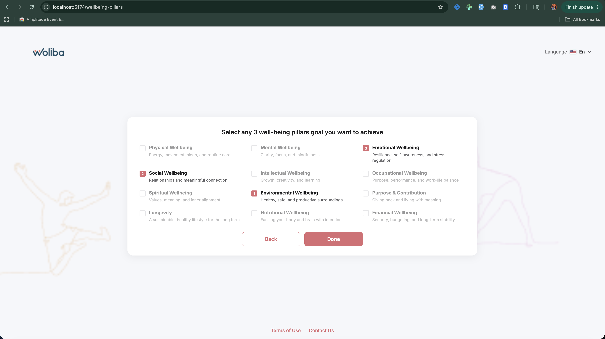

---

## Step 7 — Processing

- `docs/screenshots/P-7.1.png`
- `docs/screenshots/P-7.2.png`

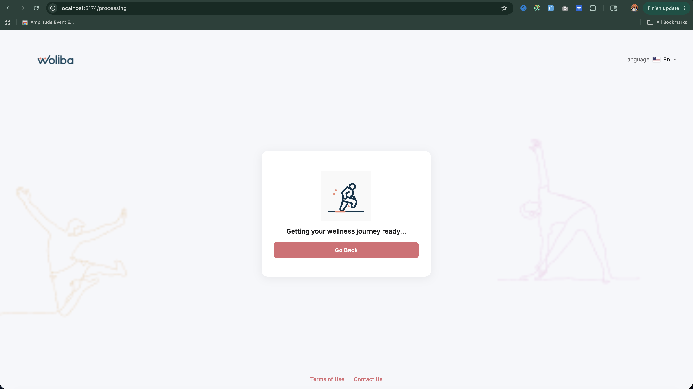
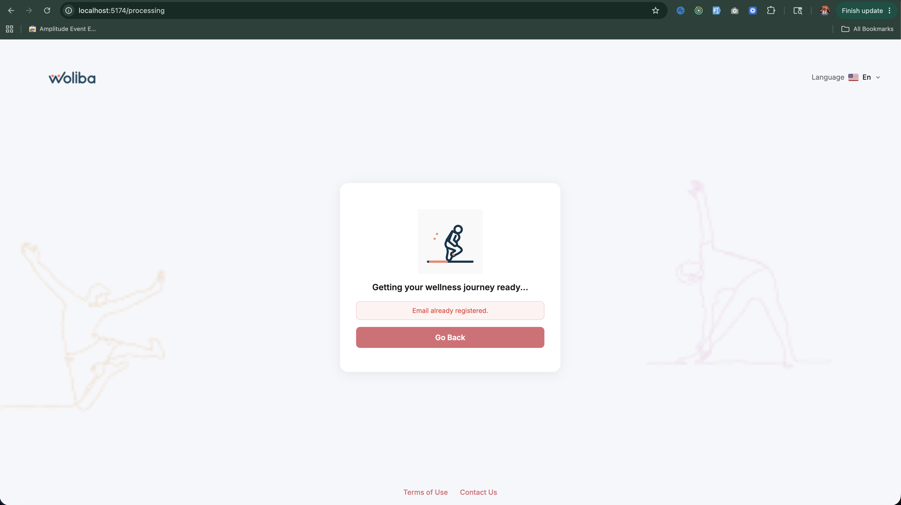

---

## Step 8 — Welcome

- `docs/screenshots/P-8.1.png`

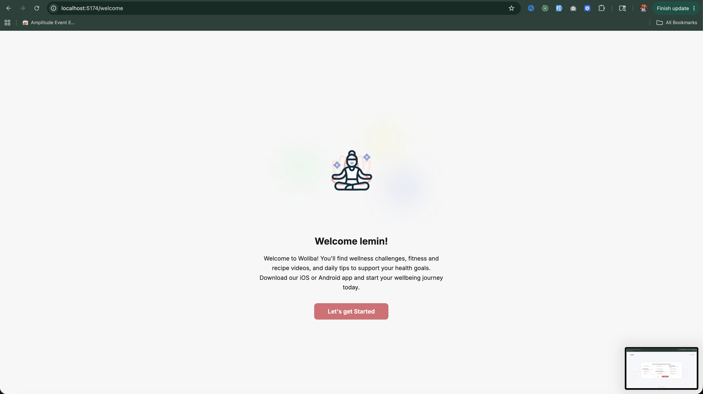

## Environment variables

This project uses Vite env vars (must be prefixed with `VITE_`). See `.env.example`.

- **`VITE_API_BASE_URL`**: Axios base URL. Default is **`/v1`** (recommended). Keeping `/v1` enables proxying in both dev + Vercel production.
- **`VITE_API_PROXY_TARGET`**: Dev-only proxy target used by Vite (`vite.config.js`).
- **`VITE_API_ORIGIN`**: Used for `Origin`/`Referer` headers on some endpoints.
## API proxying (avoids CORS)

The app calls the API via same-origin **`/v1/*`**, then proxies/rewrites to the real Woliba API host.

- **Local dev**: Vite proxy in `vite.config.js`
- **Production (Vercel)**: rewrite rules in `vercel.json`

## Test credentials

**Assignment PDF credentials (may not exist on dev API):**
- Company name: `Woliba`
- Password: `Woliba@123!`

**Known working dev credentials (from API doc sample):**
- Company: `Alpine Intel`
- Password: `AlpineWellness`

## Deployment

### Deploy to Vercel (recommended)

1. Push this repository to GitHub.
2. In Vercel, click **Add New → Project** and import the repo.
3. Configure:
   - **Framework preset**: Vite
   - **Build command**: `npm run build`
   - **Output directory**: `dist`
4. Ensure `vercel.json` is present (it handles):
   - **API rewrite**: `/v1/:path*` → `https://dev.api.woliba.io/v1/:path*`
   - **SPA fallback**: `/(.*)` → `/index.html`
5. (Optional) Add env vars in Vercel Project Settings → Environment Variables.
6. Deploy.

### Notes for SPA routing

This is a client-side routed SPA (React Router). Without the SPA fallback rewrite, deep links like `/verify-otp` would 404 on refresh. `vercel.json` already includes the needed rewrite.

## Assumptions (if any)
- **Same-origin API base**: Default `VITE_API_BASE_URL=/v1` so dev/prod can proxy and avoid CORS.
- **API response variance**: Some endpoints may return varying response shapes across environments; helpers normalize where needed.
- **Fallback content**: Interests and pillars have fallback lists if the API is unavailable.

## Timeline Followed (28 Hours)
- Total planned/target timeline: **28 hours**
- Implemented in milestones:
  - Core registration flow + guards
  - API client hardening + helpers
  - Error boundary + a11y improvements
  - Skeleton loading states
  - Unit tests + lint/test scripts

## Integrated endpoints

- `POST /verify-by-company-name-and-password`
- `POST /save-user-details-and-send-otp`
- `POST /verify-otp-for-user-registration`
- `POST /send-otp-for-user-registration`
- `GET /viewWellnessInterest`
- `GET /get-wellbeing-pillars/{language_id}`
- `POST /user-registration`
